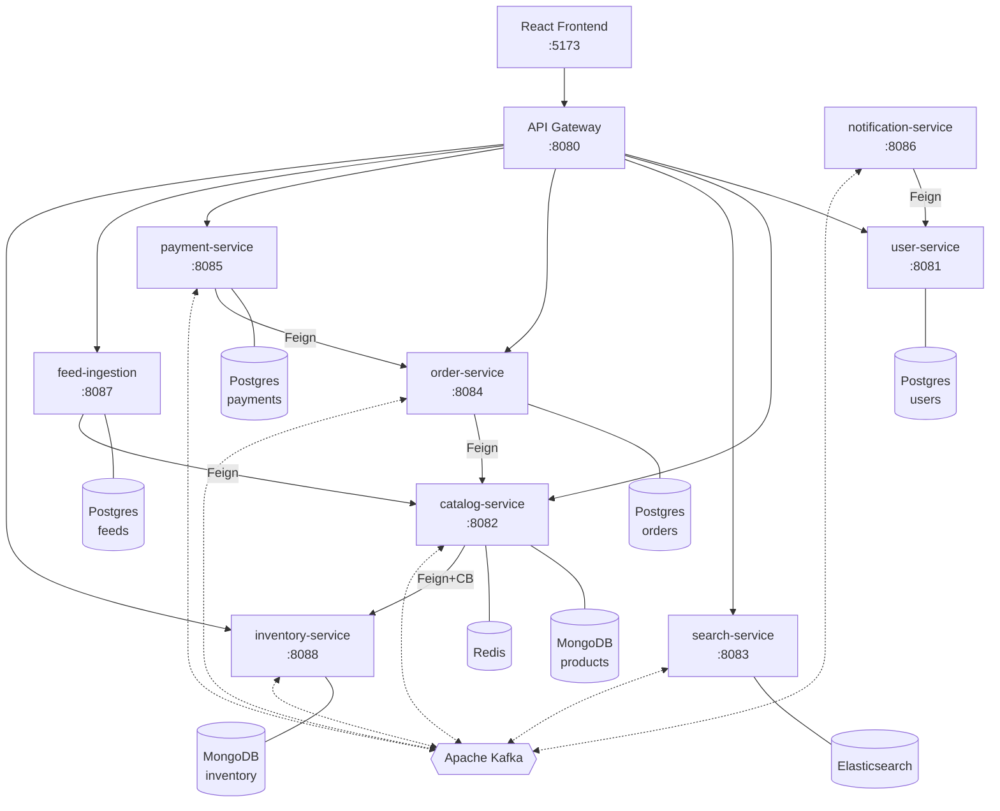
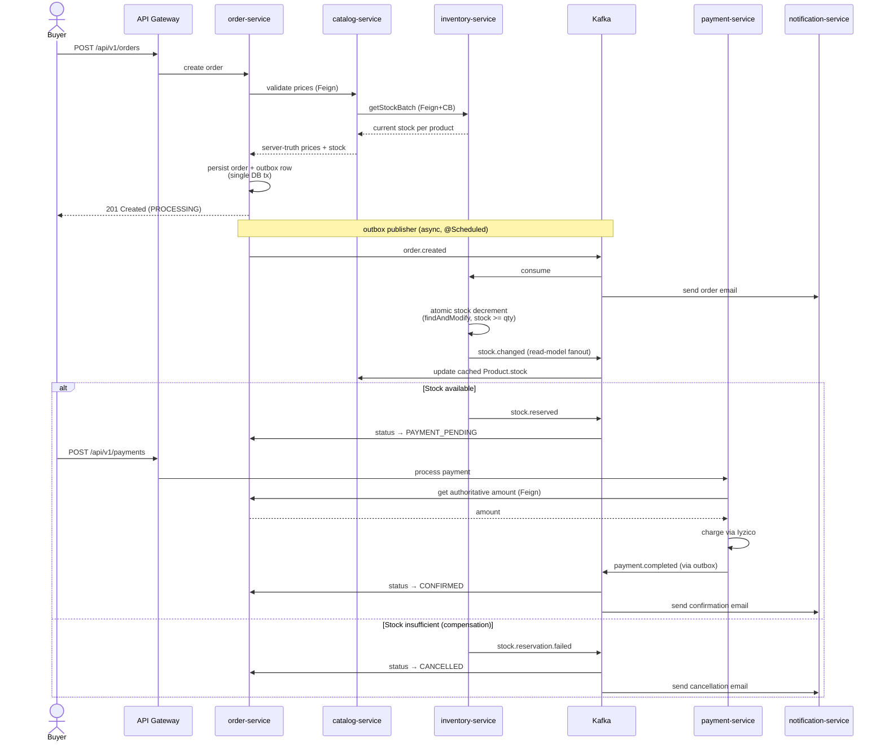

# Marketplace

A modern e-commerce platform built with microservices architecture.


## Overview

Marketplace is a full-stack e-commerce platform featuring buyer and seller workflows, real-time search, Kafka-based event-driven communication, and Iyzico payment integration.

## Architecture

Solid arrows are synchronous calls (HTTP/Feign). Dashed arrows are asynchronous Kafka events. Each service owns its own datastore — no service reads another service's database directly.



Cross-cutting infrastructure (not shown above to keep the diagram readable):
- **Eureka** (`:8761`) — service discovery; every service registers on startup.
- **Spring Cloud Config** (`:8888`) — centralized configuration.
- **Prometheus + Tempo + Grafana** (`:3001`) — metrics scraping, distributed tracing, and the pre-provisioned overview dashboard.


## Services

| Service | Port | Description | Stack |
|---------|------|-------------|-------|
| api-gateway | 8080 | Routes requests, JWT cookie validation, identity header injection | Spring Cloud Gateway |
| user-service | 8081 | Auth, buyer/seller registration, rotating refresh tokens | Spring Boot, PostgreSQL, Redis, JWT |
| catalog-service | 8082 | Product CRUD, validate, seller stats; reads stock from inventory via Feign+CB | Spring Boot, MongoDB, Redis, OpenFeign, Resilience4j |
| search-service | 8083 | Full-text product search | Spring Boot, Elasticsearch |
| order-service | 8084 | Order management, Saga pattern | Spring Boot, PostgreSQL, Kafka |
| payment-service | 8085 | Payment processing | Spring Boot, PostgreSQL, Iyzico |
| notification-service | 8086 | Email notifications | Spring Boot, Kafka, JavaMail |
| feed-ingestion-service | 8087 | Google Merchant XML catalog import | Spring Boot, PostgreSQL, OpenFeign |
| inventory-service | 8088 | Atomic stock reservations, saga participant, stock truth | Spring Boot, MongoDB, Kafka |
| config-server | 8888 | Centralized configuration | Spring Cloud Config |
| discovery-server | 8761 | Service discovery | Eureka |

## Tech Stack

### Backend
- **Java 21** + **Spring Boot 3.5**
- **Spring Cloud** (Gateway, Eureka, Config)
- **Apache Kafka** — event-driven communication
- **PostgreSQL** — relational data (users, orders, payments)
- **MongoDB** — product catalog
- **Redis** — caching, refresh token session storage
- **Elasticsearch** — product search
- **Iyzico** — payment processing
- **Flyway** — database migrations

### Frontend
- **React 18** + **TypeScript**
- **TanStack Router** + **TanStack Query**
- **Zustand** — state management
- **Tailwind CSS** + **shadcn/ui**
- **Vite** — build tool

### Infrastructure
- **Docker Compose** — local development
- **Nginx** — frontend serving
- **Hetzner Cloud** — production hosting
- **GitHub Actions** — CI/CD

## Authentication

The platform uses a dual-token, httpOnly cookie-based auth flow. No tokens are ever stored in `localStorage` or readable from JavaScript.

### Token design

| Token | TTL | Storage | Cookie flags |
|-------|-----|---------|--------------|
| Access token (signed JWT) | 15 min | httpOnly cookie, `Path=/` | `Secure; SameSite=Lax` |
| Refresh token (opaque random) | 7 days | httpOnly cookie, `Path=/api/v1/auth/refresh` | `Secure; SameSite=Lax` |

The refresh token's `Path` restriction means the browser only attaches it to requests going to the refresh endpoint — it is never accidentally sent elsewhere.

### Token storage (server-side)

Refresh tokens are stored in two layers:

- **Redis** (`auth:refresh:{sha256(token)} → userId`, TTL 7 days) — fast lookup on every refresh call.
- **PostgreSQL** (`refresh_tokens` table) — audit trail, `revoked` flag, `ip`, `user_agent`, `session_id`. Survives Redis eviction.

Multi-session: each login issues an independent token pair. A user can be logged in on phone and laptop simultaneously.

### Refresh flow

```
POST /api/v1/auth/refresh   (browser sends refresh_token cookie automatically)
  → hash token → lookup Redis
  → if found: mark old token revoked in Redis + DB
              issue new access token + new refresh token (rotation)
              set new cookies
  → if not found: token expired or already rotated
```

### Replay attack detection

If a **revoked** refresh token is presented (e.g. the token was already rotated but an attacker replayed the old one), all active sessions for that user are immediately revoked in Redis and the database, forcing a full re-login on every device.

### API Gateway JWT filter

The gateway strips incoming `X-User-Id`, `X-User-Email`, and `X-Account-Type` headers (prevents injection), then reads the `access_token` cookie, validates the JWT, and re-adds those headers for downstream services. Downstream services trust gateway-supplied headers and do not re-validate tokens.

### Auth endpoints

| Method | Path | Description |
|--------|------|-------------|
| `POST` | `/api/v1/auth/login` | Issue access + refresh tokens as cookies |
| `POST` | `/api/v1/auth/buyer/register` | Register buyer, issue cookies |
| `POST` | `/api/v1/auth/seller/register` | Register seller, issue cookies |
| `POST` | `/api/v1/auth/refresh` | Rotate refresh token, reissue access token |
| `POST` | `/api/v1/auth/logout` | Revoke current session, clear cookies |
| `POST` | `/api/v1/auth/logout-all` | Revoke all sessions for user |
| `GET`  | `/api/v1/auth/me` | Return user info from access token cookie |

### Frontend session restore

On every page load the React app calls `GET /api/v1/auth/me`. If the access token cookie is valid the user is restored to authenticated state silently. If the access token has expired, the `apiClient` 401 interceptor calls `/api/v1/auth/refresh` automatically, drains any queued requests, and retries. If refresh also fails the store is cleared and the user is redirected to `/login`.

## Order Saga

Order placement is a Saga choreography across `order-service`, `catalog-service`, `inventory-service`, and `payment-service`. Catalog owns product data; inventory owns stock truth and is the saga participant for reservation/release. Each step is driven by a Kafka event; failures trigger compensating actions instead of a distributed transaction.



If payment fails after stock has been reserved, `payment.failed` triggers a stock release in `inventory-service` (idempotent) before the order is marked `CANCELLED`. Every stock change publishes `stock.changed` so `catalog-service` can keep `Product.stock` (cached read model) in sync; `product.updated` events are also fanned out to `search-service` so the Elasticsearch index reflects current stock and pricing.

### Reliability patterns in use

| Concern | Mechanism |
|---|---|
| Atomic order + event publishing | Transactional outbox (`order-service`, `payment-service`) with a `@Scheduled` poller |
| Lost messages on consumer failure | `DefaultErrorHandler` + `DeadLetterPublishingRecoverer` — 3 retries, then `<topic>.DLT` |
| Slow / failing dependency | Resilience4j circuit breaker on `order → product`, `payment → order`, `payment → iyzico` |
| Idempotent order creation | Required `idempotencyKey` on `POST /orders` |
| Idempotent stock reservation | `StockReservation` document keyed by `orderId` (RESERVED → RELEASED) |
| Price / amount tampering | Server-authoritative: order pulls `currentPrice` from product, payment pulls `amount` from order |
| Cross-user payment block | `order-service` checks `order.userId == X-User-Id`; payment service uses Feign so the check covers both paths |

## Getting Started

### Prerequisites

- Java 21
- Maven 3.9+
- Docker + Docker Compose
- Node.js 20+ + pnpm

### Local Development

1. **Clone the repository**
```bash
git clone https://github.com/yigitdemirko/marketplace.git
cd marketplace
```

2. **Create environment file**
```bash
cp .env.example .env
# Edit .env with your credentials
```

3. **Build all services**
```bash
make build
```

4. **Start all services**
```bash
make up
```

5. **Start frontend**
```bash
cd frontend
pnpm install
pnpm dev
```

6. **Access the application**
- Frontend: http://localhost:5173
- API Gateway: http://localhost:8080
- Swagger UI: http://localhost:8080/swagger-ui/index.html
- Eureka Dashboard: http://localhost:8761

### Environment Variables

Create a `.env` file in the root directory:

```env
# Auth
JWT_SECRET=your-secret-key-min-32-chars

# Cookies (leave COOKIE_DOMAIN blank for localhost)
COOKIE_DOMAIN=
COOKIE_SECURE=false   # set true in production (requires HTTPS)

# Payment
IYZICO_API_KEY=your-sandbox-api-key
IYZICO_SECRET_KEY=your-sandbox-secret-key

# Email
MAIL_USERNAME=your-email@gmail.com
MAIL_PASSWORD=your-app-password
```

### Makefile Commands

```bash
make build          # Build all services
make up             # Start all services
make down           # Stop all services
make clean          # Stop services and remove volumes
make test           # Run all tests
make seed           # Seed demo data (2 sellers, 5 buyers, 50 products, ~10 orders)
```

### Seeding demo data

After `make up` finishes and the stack is healthy, run:

```bash
make seed
```

This creates 2 seller accounts (`techhub@demo.marketplace.com`, `homestyle@demo.marketplace.com`), 5 buyer accounts, imports a 50-product Google Merchant XML feed via the `feed-ingestion-service`, and places ~10 orders across the buyers. All accounts use the password `Demo1234`. Re-running is safe at the user level (register-or-login fallback) but creates duplicate products — for a clean reset use `make clean && make up && make seed`. Requires `jq` and `uuidgen` on PATH.

## API Documentation

Swagger UI is available at: `http://localhost:8080/swagger-ui/index.html`

All services are accessible via the API Gateway at `http://localhost:8080`:

| Service | Base Path |
|---------|-----------|
| Auth | `/api/v1/auth` |
| Users | `/api/v1/users` |
| Products | `/api/v1/products` |
| Search | `/api/v1/search` |
| Orders | `/api/v1/orders` |
| Payments | `/api/v1/payments` |
| Feeds | `/api/v1/feeds` |

## Testing

```bash
# Run unit tests
mvn test -pl services/user-service,services/catalog-service,services/inventory-service,services/search-service,services/order-service,services/payment-service -Dgroups=unit

# Run integration tests
mvn test -pl services/user-service,services/catalog-service,services/inventory-service -Dgroups=integration
```

## CI/CD

- **CI** — Runs on PRs with `backend` or `frontend` label
    - Backend: unit tests + integration tests
    - Frontend: TypeScript check + production build
- **Deploy** — Runs on every push to `main`, deploys only changed services

## Project Structure

```
marketplace/
├── infrastructure/
│   ├── api-gateway/
│   ├── config-server/
│   ├── discovery-server/
│   └── postgres/
├── services/
│   ├── user-service/
│   ├── catalog-service/
│   ├── inventory-service/
│   ├── search-service/
│   ├── order-service/
│   ├── payment-service/
│   ├── notification-service/
│   └── feed-ingestion-service/
├── frontend/
├── docker-compose.yaml
├── Makefile
└── pom.xml
```

## License

MIT