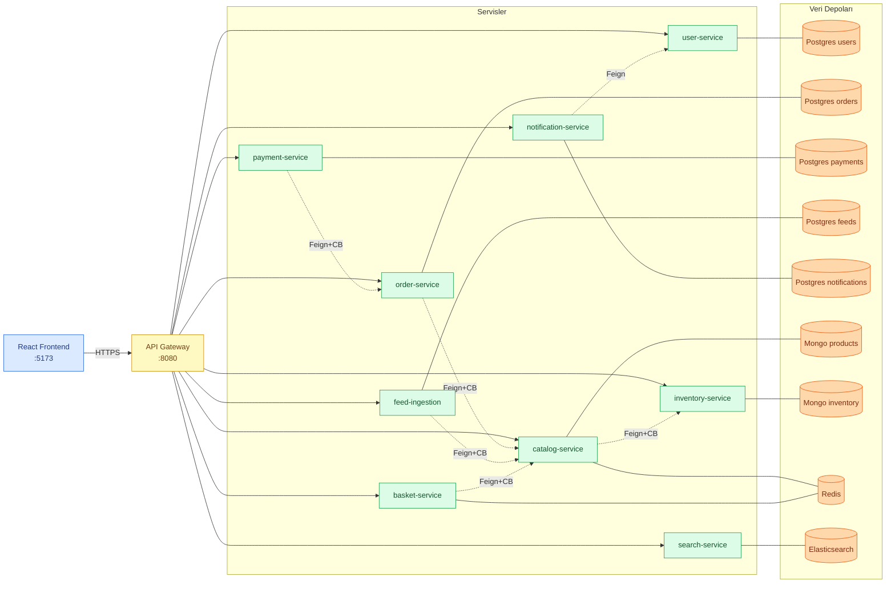
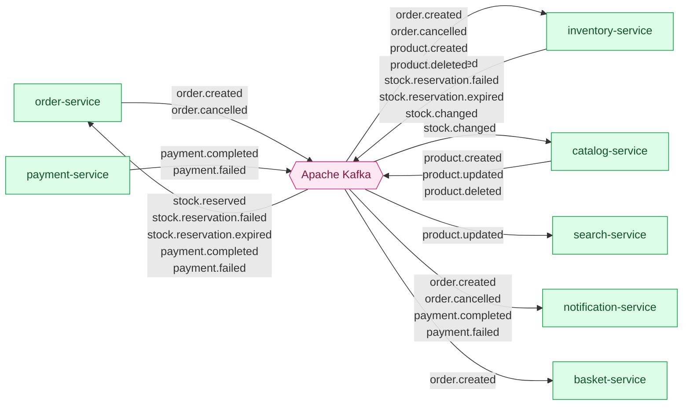
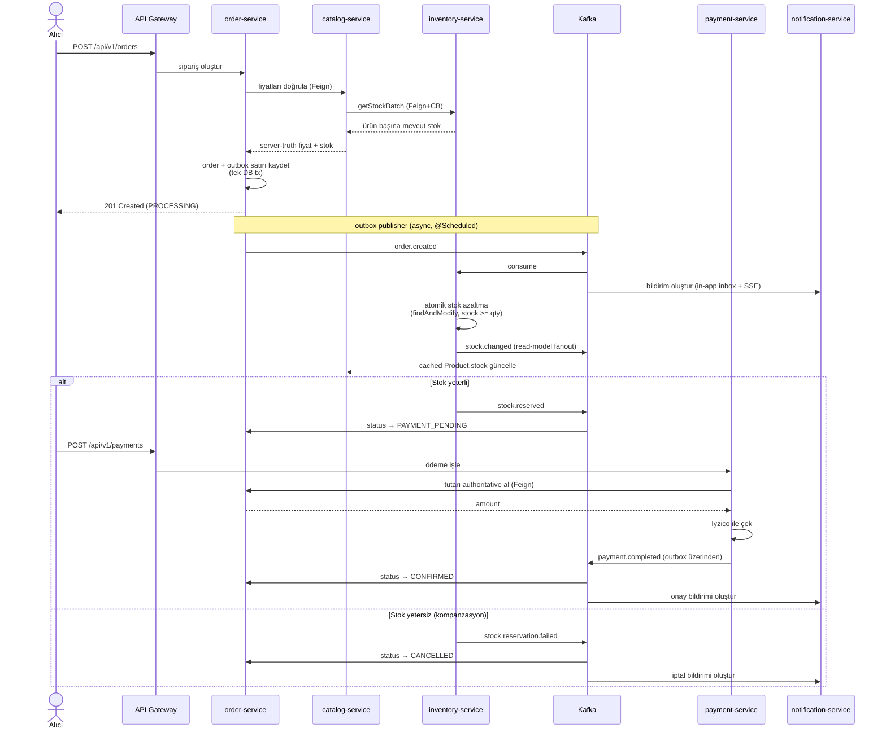
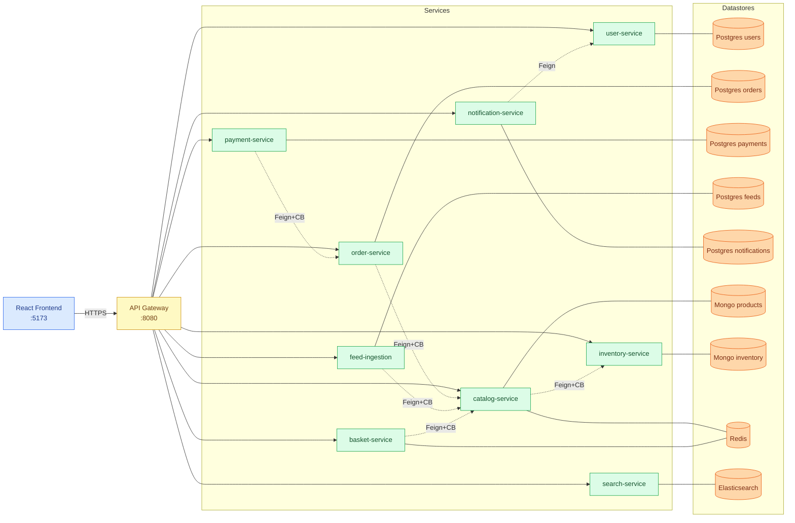
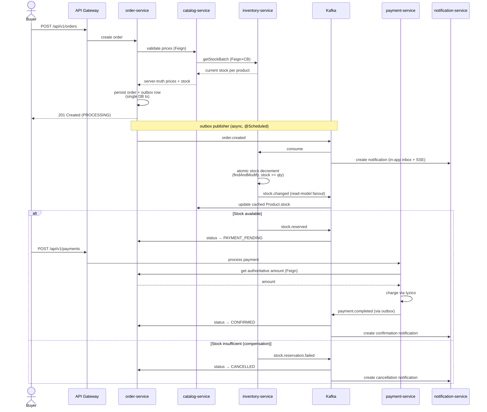

# Marketplace

A modern e-commerce platform built with microservices architecture.


**Diller / Languages:** [Türkçe](#türkçe) · [English](#english)

**Servis dokümanları / Service walkthroughs:** [`docs/walkthrough/`](docs/walkthrough/)

## Production / Canlı Ortam

| URL | Açıklama / Description |
|-----|-----------------------|
| https://bilbos-shop.com | Buyer storefront (frontend) |
| https://seller.bilbos-shop.com | Seller paneli (subdomain) |
| https://api.bilbos-shop.com | API Gateway |
| https://api.bilbos-shop.com/swagger-ui/index.html | Aggregated Swagger UI |
| https://grafana.bilbos-shop.com | Grafana dashboard *(internal)* |

> Cookie domain `.bilbos-shop.com` ile her iki subdomain'de tek oturum geçerlidir. / Single sign-on across both subdomains via cookie domain `.bilbos-shop.com`.

---

## Türkçe

### İçindekiler

1. [Genel Bakış](#genel-bakış)
2. [Mimari](#mimari)
3. [Servisler](#servisler)
4. [Teknoloji Yığını](#teknoloji-yığını)
5. [Kimlik Doğrulama](#kimlik-doğrulama)
6. [Sipariş Saga'sı](#sipariş-sagası)
7. [Gözlemlenebilirlik](#gözlemlenebilirlik)
8. [Başlarken](#başlarken)
9. [Demo Hesaplar](#demo-hesaplar)
10. [API Dokümantasyonu](#api-dokümantasyonu)
11. [Test](#test)
12. [CI/CD](#cicd)
13. [Proje Yapısı](#proje-yapısı)

### Genel Bakış

Marketplace; alıcı ve satıcı akışları, gerçek zamanlı arama, Kafka ile event-based iletişim ve Iyzico ödeme entegrasyonu içeren tam yığın bir e-ticaret platformudur.

### Mimari

Sistem iki ayrı diyagramla anlatılıyor: **senkron akış** (HTTP/Feign) ve **asenkron olay akışı** (Kafka). Her servis kendi veri deposuna sahiptir — başka bir servisin veritabanından doğrudan okuma yapılmaz.

#### Senkron Akış — HTTP & Feign



#### Asenkron Akış — Kafka Olayları



Diyagramlarda gösterilmeyen kesişen altyapı:
- **Eureka** (`:8761`) — servis keşfi; her servis başlangıçta kayıt olur.
- **Spring Cloud Config** (`:8888`) — merkezi konfigürasyon.
- **Prometheus + Tempo + Grafana + Loki** — metrik, izleme, log toplama ve hazır panel.

### Servisler

| Servis | Port | Açıklama | Yığın |
|--------|------|----------|-------|
| api-gateway | 8080 | Routing, JWT cookie doğrulama, identity header injection | Spring Cloud Gateway |
| user-service | 8081 | Auth, alıcı/satıcı kayıt, rotasyonlu refresh token | Spring Boot, PostgreSQL, Redis, JWT |
| catalog-service | 8082 | Ürün CRUD, validate, satıcı istatistikleri; stoğu inventory'den Feign+CB ile okur | Spring Boot, MongoDB, Redis, OpenFeign, Resilience4j |
| search-service | 8083 | Tam metin ürün araması | Spring Boot, Elasticsearch |
| order-service | 8084 | Sipariş yönetimi, Saga deseni | Spring Boot, PostgreSQL, Kafka |
| payment-service | 8085 | Ödeme işleme | Spring Boot, PostgreSQL, Iyzico |
| notification-service | 8086 | Uygulama içi bildirim merkezi (in-app inbox) + SSE push | Spring Boot, PostgreSQL, Kafka, SSE |
| feed-ingestion-service | 8087 | Google Merchant XML katalog içe aktarımı | Spring Boot, PostgreSQL, OpenFeign |
| inventory-service | 8088 | Atomik stok rezervasyonu, saga participant, stok kaynağı | Spring Boot, MongoDB, Kafka |
| basket-service | 8089 | Server-side cart (Redis), kullanıcı başına TTL'li, sipariş sonrası otomatik temizlik | Spring Boot, Redis, Kafka, OpenFeign |
| config-server | 8888 | Merkezi konfigürasyon | Spring Cloud Config |
| discovery-server | 8761 | Servis keşfi | Eureka |

### Teknoloji Yığını

**Backend**
- **Java 21** + **Spring Boot 3.5**
- **Spring Cloud** (Gateway, Eureka, Config)
- **Apache Kafka** — event-based iletişim
- **PostgreSQL** — ilişkisel veri (users, orders, payments)
- **MongoDB** — ürün kataloğu, envanter
- **Redis** — önbellek, refresh token oturum saklama
- **Elasticsearch** — ürün araması
- **Iyzico** — ödeme işleme
- **Flyway** — veritabanı migrasyonu

**Frontend**
- **React 18** + **TypeScript**
- **TanStack Router** + **TanStack Query**
- **Zustand** — durum yönetimi
- **Tailwind CSS** + **shadcn/ui**
- **Vite** — build aracı

**Altyapı**
- **Docker Compose** — lokal geliştirme
- **Nginx** — frontend servis
- **Hetzner Cloud** — production hosting
- **GitHub Actions** — CI/CD

### Kimlik Doğrulama

Platform, çift token + httpOnly cookie tabanlı bir auth akışı kullanır. Hiçbir token `localStorage`'da tutulmaz veya JavaScript tarafından okunamaz.

**Token tasarımı**

| Token | TTL | Saklama | Cookie bayrakları |
|-------|-----|---------|-------------------|
| Access token (imzalı JWT) | 15 dk | httpOnly cookie, `Path=/` | `Secure; SameSite=Lax` |
| Refresh token (opak rastgele) | 7 gün | httpOnly cookie, `Path=/api/v1/auth/refresh` | `Secure; SameSite=Lax` |

Refresh token'ın `Path` kısıtlaması sayesinde tarayıcı bu cookie'yi yalnızca refresh endpoint'ine giden isteklere ekler — yanlışlıkla başka yere gönderilmez.

**Sunucu tarafı saklama**

Refresh token'lar iki katmanda saklanır:
- **Redis** (`auth:refresh:{sha256(token)} → userId`, TTL 7 gün) — her refresh çağrısında hızlı arama.
- **PostgreSQL** (`refresh_tokens` tablosu) — audit trail, `revoked` flag, `ip`, `user_agent`, `session_id`. Redis eviction'dan bağımsız korunur.

Çoklu oturum: her giriş bağımsız bir token çifti üretir. Kullanıcı aynı anda telefon ve laptop'ta açık olabilir.

**Refresh akışı**

```
POST /api/v1/auth/refresh   (tarayıcı refresh_token cookie'sini otomatik gönderir)
  → token'ı hashle → Redis'te ara
  → bulundu: eski token'ı Redis + DB'de revoked olarak işaretle
              yeni access token + yeni refresh token üret (rotation)
              yeni cookie'leri set et
  → bulunamadı: token süresi dolmuş veya zaten rotate edilmiş
```

**Replay saldırı tespiti**

**Revoked** bir refresh token sunulursa (örn. token rotate edilmiş ama saldırgan eskisini tekrar oynattı), kullanıcının tüm aktif oturumları Redis ve veritabanında anında iptal edilir, her cihazda yeniden giriş zorunlu hale gelir.

**API Gateway JWT filtresi**

Gateway, gelen `X-User-Id`, `X-User-Email`, `X-Account-Type` header'larını önce siler (header injection saldırılarına karşı), sonra `access_token` cookie'sini okur, JWT'yi doğrular ve bu header'ları downstream servisler için yeniden ekler. Downstream servisler gateway'in koyduğu header'lara güvenir, token'ı yeniden doğrulamaz.

**Auth endpoint'leri**

| Method | Path | Açıklama |
|--------|------|----------|
| `POST` | `/api/v1/auth/login` | Access + refresh token cookie olarak verilir |
| `POST` | `/api/v1/auth/buyer/register` | Alıcı kaydı + cookie'ler |
| `POST` | `/api/v1/auth/seller/register` | Satıcı kaydı + cookie'ler |
| `POST` | `/api/v1/auth/refresh` | Refresh token rotate edilir, access token yenilenir |
| `POST` | `/api/v1/auth/logout` | Mevcut oturum iptal, cookie'ler temizlenir |
| `POST` | `/api/v1/auth/logout-all` | Kullanıcının tüm oturumları iptal |
| `GET`  | `/api/v1/auth/me` | Access token cookie'sinden kullanıcı bilgisi döner |

**Frontend oturum geri yükleme**

React uygulaması her sayfa yüklemesinde `GET /api/v1/auth/me` çağırır. Access token cookie'si geçerliyse kullanıcı sessizce auth state'ine restore edilir. Süresi dolmuşsa `apiClient` 401 interceptor'ı otomatik olarak `/api/v1/auth/refresh` çağırır, kuyruğa giren istekleri çeker ve tekrar dener. Refresh de başarısızsa store temizlenir ve `/login`'e yönlendirme yapılır.

### Sipariş Saga'sı

Sipariş oluşturma; `order-service`, `catalog-service`, `inventory-service` ve `payment-service` üzerinde Saga choreography ile yönetilir. Catalog ürün verisinin sahibidir; inventory stok kaynağıdır ve rezervasyon/serbest bırakma için saga participant'tır. Her adım bir Kafka olayıyla tetiklenir; başarısızlıklar dağıtık transaction yerine kompanzasyon eylemleriyle çözülür.



Stok rezerve edildikten sonra ödeme başarısız olursa `payment.failed` olayı `inventory-service`'te stok serbest bırakmayı tetikler (idempotent), ardından sipariş `CANCELLED` olarak işaretlenir. Her stok değişiminde `stock.changed` yayınlanarak `catalog-service`'in cached `Product.stock`'u senkron tutulur; `product.updated` olayları `search-service`'e iletilerek Elasticsearch indeksi güncel stok ve fiyatı yansıtır.

**Kullanılan güvenilirlik desenleri**

| Konu | Mekanizma |
|---|---|
| Atomik order + olay yayınlama | Transactional outbox (`order-service`, `payment-service`) + `@Scheduled` poller |
| Consumer hatasında kayıp mesaj | `DefaultErrorHandler` + `DeadLetterPublishingRecoverer` — 3 retry, sonra `<topic>.DLT` |
| Yavaş / hatalı bağımlılık | Resilience4j circuit breaker: `order → catalog`, `catalog → inventory`, `payment → order`, `payment → iyzico`, `feed → catalog` |
| Idempotent sipariş oluşturma | `POST /orders` üzerinde zorunlu `idempotencyKey` |
| Idempotent stok rezervasyonu | `orderId` ile keylenmiş `StockReservation` (RESERVED → RELEASED) |
| Orphan rezervasyon | Mongo TTL alanı + `@Scheduled` cleanup, `stock.reservation.expired` yayınlar |
| Fiyat / tutar tampering | Server-authoritative: order ürünün `currentPrice`'ını çeker, payment order'dan `amount` alır |
| Cross-user payment engelleme | `order-service` `order.userId == X-User-Id` kontrolü; payment Feign üzerinden bu kontrolden geçer |

### Gözlemlenebilirlik

Üç ayaklı tam observability stack'i kurulu:

| Bileşen | Port | Rol |
|---------|------|-----|
| **Grafana** | 3001 | Birleşik UI (anonim Admin) — pre-provisioned dashboard |
| **Prometheus** | 9090 | Metrik scrape (8 servis × `/actuator/prometheus`, 7 gün retention) |
| **Tempo** | 3200, 4317/4318 | Dağıtık izleme (OTLP receiver) |
| **Loki** | 3100 | Merkezi log toplama |
| **Promtail** | — | Docker container log'larını Loki'ye iletir |

**Distributed tracing** — Tüm servisler `micrometer-tracing-bridge-otel` + `opentelemetry-exporter-otlp` ile span üretir. `traceId` ve `spanId` her log satırına otomatik eklenir (`logging.pattern.correlation`). Bir HTTP isteği gateway'den geldiğinde, downstream servislere kadar tek bir trace altında takip edilir; Grafana service map'i node graph olarak görselleştirir.

**Pre-provisioned dashboard** — `marketplace-overview` 5 satırlık panel: Service Health (tüm servisler tek panelde UP/DOWN), Traffic (req/s + 5xx error rate), Latency (order/payment/catalog p50/p95/p99), JVM (heap, GC pause, live thread), System (CPU, HikariCP connection pool, process uptime). Tüm sorgular `$__rate_interval` kullanır.

**Demo:** order-service durdurulduğunda CB paneli `OPEN` olur (kırmızı), istekler fail-fast döner, tracing'de fallback path görünür.

### Başlarken

**Gereksinimler**

- Java 21
- Maven 3.9+
- Docker + Docker Compose
- Node.js 20+ + pnpm

**Lokal geliştirme**

1. **Repoyu klonla**
```bash
git clone https://github.com/yigitdemirko/marketplace.git
cd marketplace
```

2. **Ortam dosyası oluştur**
```bash
cp .env.example .env
# .env dosyasını kendi bilgilerinle doldur
```

3. **Tüm servisleri build et**
```bash
make build
```

4. **Tüm servisleri ayağa kaldır**
```bash
make up
```

5. **Frontend'i çalıştır**
```bash
cd frontend
pnpm install
pnpm dev
```

6. **Erişim**

| URL | Açıklama |
|-----|----------|
| http://localhost:5173 | Frontend (React) |
| http://localhost:8080 | API Gateway |
| http://localhost:8080/swagger-ui/index.html | Aggregated Swagger UI |
| http://localhost:8761 | Eureka dashboard |
| http://localhost:3001 | Grafana (anonim admin) |
| http://localhost:9090 | Prometheus |
| http://localhost:3200 | Tempo |
| http://localhost:3100 | Loki |

**Ortam değişkenleri**

Kök dizinde `.env` dosyası oluştur:

```env
# Auth
JWT_SECRET=your-secret-key-min-32-chars

# Cookies (localhost için COOKIE_DOMAIN boş bırakılır)
COOKIE_DOMAIN=
COOKIE_SECURE=false   # production'da true (HTTPS gerekir)

# Payment
IYZICO_API_KEY=your-sandbox-api-key
IYZICO_SECRET_KEY=your-sandbox-secret-key

# Frontend (production deploy için)
FRONTEND_URL=https://bilbos-shop.com
SELLER_URL=https://seller.bilbos-shop.com
API_SERVER_URL=https://api.bilbos-shop.com
```

> Not: Tam liste için `.env.example` dosyasına bakın.
**Makefile komutları**

```bash
make build          # Tüm servisleri build et
make up             # Tüm servisleri ayağa kaldır
make down           # Servisleri durdur
make clean          # Servisleri durdur ve volume'leri sil
make test           # Tüm testleri çalıştır
make seed           # Demo verisi seed et (2 satıcı, 5 alıcı, 50 ürün, ~10 sipariş)
```

**Demo verisi seed**

`make up` tamamlandıktan ve stack sağlıklı hale geldikten sonra:

```bash
make seed
```

Bu komut 8 satıcı, 5 alıcı, `feed-ingestion-service` üzerinden 194 ürünlük Google Merchant XML feed (dummyjson tabanlı) import ve alıcılar arasında ~5-10 sipariş oluşturur. Kullanıcı düzeyinde tekrar çalıştırma güvenlidir (register-or-login fallback) ama ürünler tekrarlanır — temiz reset için `make clean && make up && make seed`. PATH üzerinde `jq` ve `uuidgen` gerekir.

### Demo Hesaplar

`make seed` sonrası kullanılabilen hesaplar — hepsinin şifresi **`Demo1234`**:

**Satıcılar (8):**

| E-posta | Mağaza |
|---------|--------|
| `info@techhub.com` | TechHub Elektronik |
| `info@sportzone.com` | SportZone Spor ve Araçlar |
| `info@kitchenplus.com` | KitchenPlus Mutfak |
| `info@freshmarket.com` | FreshMarket Gıda |
| `info@fashionx.com` | FashionX Moda |
| `info@watchbox.com` | WatchBox Saat ve Aksesuar |
| `info@beautyshop.com` | BeautyShop Güzellik |
| `info@homestyle.com` | HomeStyle Ev ve Dekorasyon |

**Alıcılar (5):**

| E-posta | İsim |
|---------|------|
| `ahmet.yilmaz@gmail.com` | Ahmet Yılmaz |
| `ayse.kara@gmail.com` | Ayşe Kara |
| `mehmet.demir@hotmail.com` | Mehmet Demir |
| `elif.sahin@gmail.com` | Elif Şahin |
| `can.ozturk@yahoo.com` | Can Öztürk |

**Iyzico sandbox test kartı:** `5528 7900 0000 0008` · son kullanma `12/2030` · CVC `123`

### API Dokümantasyonu

**Birleşik (aggregated) Swagger UI** — Gateway tüm servislerin OpenAPI dokümanlarını tek UI'da toplar:

```
http://localhost:8080/swagger-ui/index.html
```

UI üst-sağdaki dropdown'dan servis seçilir; her endpoint için "Try it out" çalışır.

**Cookie tabanlı auth** — `cookieAuth` security scheme her servis için tanımlı (`@SecurityScheme(name="cookieAuth", type=APIKEY, in=COOKIE, paramName="access_token")`). Test akışı:

1. `POST /api/v1/auth/login` çağrısını UI'dan yap → tarayıcı `access_token` cookie'sini saklar
2. Korumalı endpoint'leri direkt çağır — cookie otomatik gönderilir
3. Logout için `POST /api/v1/auth/logout`

**Servis API base path'leri** — hepsi gateway üzerinden:

| Servis | Base Path |
|--------|-----------|
| Auth | `/api/v1/auth` |
| Users | `/api/v1/users` |
| Products | `/api/v1/products` |
| Search | `/api/v1/search` |
| Orders | `/api/v1/orders` |
| Payments | `/api/v1/payments` |
| Notifications | `/api/v1/notifications` |
| Feeds | `/api/v1/feeds` |
| Inventory | `/api/v1/inventory` |
| Basket | `/api/v1/basket` |

**Servis bazlı doğrudan Swagger UI'lar** — gateway aggregation yerine tek serviste debug için:

| Servis | Swagger URL |
|--------|-------------|
| user-service | `http://localhost:8081/swagger-ui.html` |
| catalog-service | `http://localhost:8082/swagger-ui.html` |
| search-service | `http://localhost:8083/swagger-ui.html` |
| order-service | `http://localhost:8084/swagger-ui.html` |
| payment-service | `http://localhost:8085/swagger-ui.html` |
| notification-service | `http://localhost:8086/swagger-ui.html` |
| feed-ingestion-service | `http://localhost:8087/swagger-ui.html` |
| inventory-service | `http://localhost:8088/swagger-ui.html` |
| basket-service | `http://localhost:8089/swagger-ui.html` |

> Doğrudan port'tan çağrılırken auth cookie henüz set edilmemiş olabilir — login akışı için aggregated UI önerilir.

**Health & metrics endpoint'leri** — her servis Spring Actuator expose eder:

```
/actuator/health             # Liveness/readiness
/actuator/prometheus         # Prometheus scrape target
/actuator/circuitbreakers    # CB instance durumu (CB'li servisler)
/actuator/circuitbreakerevents
```

### Test

```bash
# Unit testler
mvn test -pl services/user-service,services/catalog-service,services/inventory-service,services/search-service,services/order-service,services/payment-service,services/notification-service,services/basket-service -Dgroups=unit

# Integration testler
mvn test -pl services/user-service,services/catalog-service,services/inventory-service,services/notification-service,services/basket-service -Dgroups=integration
```

### CI/CD

- **CI** — `backend` veya `frontend` etiketi olan PR'larda çalışır
    - Backend: unit testler + integration testler
    - Frontend: TypeScript check + production build
- **Deploy** — `main`'e her push'ta çalışır, sadece değişen servisleri deploy eder

### Proje Yapısı

```
marketplace/
├── shared/
│   └── common-lib/             # Ortak event DTO'ları + KafkaTopics
├── infrastructure/
│   ├── api-gateway/
│   ├── config-server/
│   └── discovery-server/
├── services/
│   ├── user-service/
│   ├── catalog-service/
│   ├── inventory-service/
│   ├── basket-service/
│   ├── search-service/
│   ├── order-service/
│   ├── payment-service/
│   ├── notification-service/
│   └── feed-ingestion-service/
├── frontend/
├── docs/
│   └── walkthrough/            # Servis başına anlatım notları
├── docker-compose.yaml
├── Makefile
└── pom.xml
```

---

## English

### Table of Contents

1. [Overview](#overview)
2. [Architecture](#architecture)
3. [Services](#services)
4. [Tech Stack](#tech-stack)
5. [Authentication](#authentication)
6. [Order Saga](#order-saga)
7. [Observability](#observability)
8. [Getting Started](#getting-started)
9. [Demo Accounts](#demo-accounts)
10. [API Documentation](#api-documentation)
11. [Testing](#testing)
12. [CI/CD](#cicd-1)
13. [Project Structure](#project-structure)

### Overview

Marketplace is a full-stack e-commerce platform featuring buyer and seller workflows, real-time search, Kafka-based event-driven communication, and Iyzico payment integration.

### Architecture

The system is described in two diagrams: **synchronous flow** (HTTP/Feign) and **async event flow** (Kafka). Each service owns its own datastore — no service reads another service's database directly.

#### Synchronous Flow — HTTP & Feign



#### Async Flow — Kafka Events


Cross-cutting infrastructure (not shown above to keep the diagrams readable):
- **Eureka** (`:8761`) — service discovery; every service registers on startup.
- **Spring Cloud Config** (`:8888`) — centralized configuration.
- **Prometheus + Tempo + Grafana + Loki** — metrics, tracing, log aggregation, and the pre-provisioned overview dashboard.

### Services

| Service | Port | Description | Stack |
|---------|------|-------------|-------|
| api-gateway | 8080 | Routes requests, JWT cookie validation, identity header injection | Spring Cloud Gateway |
| user-service | 8081 | Auth, buyer/seller registration, rotating refresh tokens | Spring Boot, PostgreSQL, Redis, JWT |
| catalog-service | 8082 | Product CRUD, validate, seller stats; reads stock from inventory via Feign+CB | Spring Boot, MongoDB, Redis, OpenFeign, Resilience4j |
| search-service | 8083 | Full-text product search | Spring Boot, Elasticsearch |
| order-service | 8084 | Order management, Saga pattern | Spring Boot, PostgreSQL, Kafka |
| payment-service | 8085 | Payment processing | Spring Boot, PostgreSQL, Iyzico |
| notification-service | 8086 | In-app notification inbox + SSE push | Spring Boot, PostgreSQL, Kafka, SSE |
| feed-ingestion-service | 8087 | Google Merchant XML catalog import | Spring Boot, PostgreSQL, OpenFeign |
| inventory-service | 8088 | Atomic stock reservations, saga participant, stock truth | Spring Boot, MongoDB, Kafka |
| basket-service | 8089 | Server-side cart (Redis), per-user TTL, auto-cleared after order | Spring Boot, Redis, Kafka, OpenFeign |
| config-server | 8888 | Centralized configuration | Spring Cloud Config |
| discovery-server | 8761 | Service discovery | Eureka |

### Tech Stack

**Backend**
- **Java 21** + **Spring Boot 3.5**
- **Spring Cloud** (Gateway, Eureka, Config)
- **Apache Kafka** — event-driven communication
- **PostgreSQL** — relational data (users, orders, payments)
- **MongoDB** — product catalog, inventory
- **Redis** — caching, refresh token session storage
- **Elasticsearch** — product search
- **Iyzico** — payment processing
- **Flyway** — database migrations

**Frontend**
- **React 18** + **TypeScript**
- **TanStack Router** + **TanStack Query**
- **Zustand** — state management
- **Tailwind CSS** + **shadcn/ui**
- **Vite** — build tool

**Infrastructure**
- **Docker Compose** — local development
- **Nginx** — frontend serving
- **Hetzner Cloud** — production hosting
- **GitHub Actions** — CI/CD

### Authentication

The platform uses a dual-token, httpOnly cookie-based auth flow. No tokens are ever stored in `localStorage` or readable from JavaScript.

**Token design**

| Token | TTL | Storage | Cookie flags |
|-------|-----|---------|--------------|
| Access token (signed JWT) | 15 min | httpOnly cookie, `Path=/` | `Secure; SameSite=Lax` |
| Refresh token (opaque random) | 7 days | httpOnly cookie, `Path=/api/v1/auth/refresh` | `Secure; SameSite=Lax` |

The refresh token's `Path` restriction means the browser only attaches it to requests going to the refresh endpoint — it is never accidentally sent elsewhere.

**Token storage (server-side)**

Refresh tokens are stored in two layers:
- **Redis** (`auth:refresh:{sha256(token)} → userId`, TTL 7 days) — fast lookup on every refresh call.
- **PostgreSQL** (`refresh_tokens` table) — audit trail, `revoked` flag, `ip`, `user_agent`, `session_id`. Survives Redis eviction.

Multi-session: each login issues an independent token pair. A user can be logged in on phone and laptop simultaneously.

**Refresh flow**

```
POST /api/v1/auth/refresh   (browser sends refresh_token cookie automatically)
  → hash token → lookup Redis
  → if found: mark old token revoked in Redis + DB
              issue new access token + new refresh token (rotation)
              set new cookies
  → if not found: token expired or already rotated
```

**Replay attack detection**

If a **revoked** refresh token is presented (e.g. the token was already rotated but an attacker replayed the old one), all active sessions for that user are immediately revoked in Redis and the database, forcing a full re-login on every device.

**API Gateway JWT filter**

The gateway strips incoming `X-User-Id`, `X-User-Email`, and `X-Account-Type` headers (prevents injection), then reads the `access_token` cookie, validates the JWT, and re-adds those headers for downstream services. Downstream services trust gateway-supplied headers and do not re-validate tokens.

**Auth endpoints**

| Method | Path | Description |
|--------|------|-------------|
| `POST` | `/api/v1/auth/login` | Issue access + refresh tokens as cookies |
| `POST` | `/api/v1/auth/buyer/register` | Register buyer, issue cookies |
| `POST` | `/api/v1/auth/seller/register` | Register seller, issue cookies |
| `POST` | `/api/v1/auth/refresh` | Rotate refresh token, reissue access token |
| `POST` | `/api/v1/auth/logout` | Revoke current session, clear cookies |
| `POST` | `/api/v1/auth/logout-all` | Revoke all sessions for user |
| `GET`  | `/api/v1/auth/me` | Return user info from access token cookie |

**Frontend session restore**

On every page load the React app calls `GET /api/v1/auth/me`. If the access token cookie is valid the user is restored to authenticated state silently. If the access token has expired, the `apiClient` 401 interceptor calls `/api/v1/auth/refresh` automatically, drains any queued requests, and retries. If refresh also fails the store is cleared and the user is redirected to `/login`.

### Order Saga

Order placement is a Saga choreography across `order-service`, `catalog-service`, `inventory-service`, and `payment-service`. Catalog owns product data; inventory owns stock truth and is the saga participant for reservation/release. Each step is driven by a Kafka event; failures trigger compensating actions instead of a distributed transaction.



If payment fails after stock has been reserved, `payment.failed` triggers a stock release in `inventory-service` (idempotent) before the order is marked `CANCELLED`. Every stock change publishes `stock.changed` so `catalog-service` can keep `Product.stock` (cached read model) in sync; `product.updated` events are also fanned out to `search-service` so the Elasticsearch index reflects current stock and pricing.

**Reliability patterns in use**

| Concern | Mechanism |
|---|---|
| Atomic order + event publishing | Transactional outbox (`order-service`, `payment-service`) with a `@Scheduled` poller |
| Lost messages on consumer failure | `DefaultErrorHandler` + `DeadLetterPublishingRecoverer` — 3 retries, then `<topic>.DLT` |
| Slow / failing dependency | Resilience4j circuit breaker on `order → catalog`, `catalog → inventory`, `payment → order`, `payment → iyzico`, `feed → catalog` |
| Idempotent order creation | Required `idempotencyKey` on `POST /orders` |
| Idempotent stock reservation | `StockReservation` document keyed by `orderId` (RESERVED → RELEASED) |
| Orphan reservations | Mongo TTL field + `@Scheduled` cleanup, publishes `stock.reservation.expired` |
| Price / amount tampering | Server-authoritative: order pulls `currentPrice` from product, payment pulls `amount` from order |
| Cross-user payment block | `order-service` checks `order.userId == X-User-Id`; payment service uses Feign so the check covers both paths |

### Observability

A three-pillar observability stack is wired up:

| Component | Port | Role |
|-----------|------|------|
| **Grafana** | 3001 | Unified UI (anonymous Admin) — pre-provisioned dashboard |
| **Prometheus** | 9090 | Metrics scrape (8 services × `/actuator/prometheus`, 7-day retention) |
| **Tempo** | 3200, 4317/4318 | Distributed tracing (OTLP receiver) |
| **Loki** | 3100 | Centralized log aggregation |
| **Promtail** | — | Forwards Docker container logs to Loki |

**Distributed tracing** — All services emit spans via `micrometer-tracing-bridge-otel` + `opentelemetry-exporter-otlp`. `traceId` and `spanId` are auto-injected into every log line (`logging.pattern.correlation`). When an HTTP request enters the gateway, it is followed under a single trace through all downstream services; Grafana visualizes the service map as a node graph.

**Pre-provisioned dashboard** — `marketplace-overview` has 5 rows: Service Health (all services in one panel as UP/DOWN tiles), Traffic (req/s + 5xx error rate), Latency (order/payment/catalog p50/p95/p99), JVM (heap, GC pause, live threads), System (CPU, HikariCP pool, process uptime). All queries use `$__rate_interval`.

**Demo:** stop order-service and the CB panel turns red (OPEN); requests fail-fast; the trace shows the fallback path.

### Getting Started

**Prerequisites**

- Java 21
- Maven 3.9+
- Docker + Docker Compose
- Node.js 20+ + pnpm

**Local Development**

1. **Clone the repository**
```bash
git clone https://github.com/yigitdemirko/marketplace.git
cd marketplace
```

2. **Create environment file**
```bash
cp .env.example .env
# Edit .env with your credentials
```

3. **Build all services**
```bash
make build
```

4. **Start all services**
```bash
make up
```

5. **Start frontend**
```bash
cd frontend
pnpm install
pnpm dev
```

6. **Access the application**

| URL | Description |
|-----|-------------|
| http://localhost:5173 | Frontend (React) |
| http://localhost:8080 | API Gateway |
| http://localhost:8080/swagger-ui/index.html | Aggregated Swagger UI |
| http://localhost:8761 | Eureka dashboard |
| http://localhost:3001 | Grafana (anonymous admin) |
| http://localhost:9090 | Prometheus |
| http://localhost:3200 | Tempo |
| http://localhost:3100 | Loki |

**Environment Variables**

Create a `.env` file in the root directory:

```env
# Auth
JWT_SECRET=your-secret-key-min-32-chars

# Cookies (leave COOKIE_DOMAIN blank for localhost)
COOKIE_DOMAIN=
COOKIE_SECURE=false   # set true in production (requires HTTPS)

# Payment
IYZICO_API_KEY=your-sandbox-api-key
IYZICO_SECRET_KEY=your-sandbox-secret-key

# Frontend (for production deploy)
FRONTEND_URL=https://bilbos-shop.com
SELLER_URL=https://seller.bilbos-shop.com
API_SERVER_URL=https://api.bilbos-shop.com
```

> Note: see `.env.example` for the full list.

**Makefile Commands**

```bash
make build          # Build all services
make up             # Start all services
make down           # Stop all services
make clean          # Stop services and remove volumes
make test           # Run all tests
make seed           # Seed demo data (2 sellers, 5 buyers, 50 products, ~10 orders)
```

**Seeding demo data**

After `make up` finishes and the stack is healthy, run:

```bash
make seed
```

This creates 8 seller accounts, 5 buyer accounts, imports a 194-product Google Merchant XML feed (dummyjson-based) via the `feed-ingestion-service`, and places ~5-10 orders across the buyers. Re-running is safe at the user level (register-or-login fallback) but creates duplicate products — for a clean reset use `make clean && make up && make seed`. Requires `jq` and `uuidgen` on PATH.

### Demo Accounts

Accounts available after `make seed` — all share the password **`Demo1234`**:

**Sellers (8):**

| Email | Store |
|-------|-------|
| `info@techhub.com` | TechHub Elektronik |
| `info@sportzone.com` | SportZone Spor ve Araçlar |
| `info@kitchenplus.com` | KitchenPlus Mutfak |
| `info@freshmarket.com` | FreshMarket Gıda |
| `info@fashionx.com` | FashionX Moda |
| `info@watchbox.com` | WatchBox Saat ve Aksesuar |
| `info@beautyshop.com` | BeautyShop Güzellik |
| `info@homestyle.com` | HomeStyle Ev ve Dekorasyon |

**Buyers (5):**

| Email | Name |
|-------|------|
| `ahmet.yilmaz@gmail.com` | Ahmet Yılmaz |
| `ayse.kara@gmail.com` | Ayşe Kara |
| `mehmet.demir@hotmail.com` | Mehmet Demir |
| `elif.sahin@gmail.com` | Elif Şahin |
| `can.ozturk@yahoo.com` | Can Öztürk |

**Iyzico sandbox test card:** `5528 7900 0000 0008` · expiry `12/2030` · CVC `123`

### API Documentation

**Aggregated Swagger UI** — The gateway aggregates every service's OpenAPI spec into a single UI:

```
http://localhost:8080/swagger-ui/index.html
```

Pick a service from the top-right dropdown; "Try it out" works for every endpoint.

**Cookie-based auth** — Every service defines a `cookieAuth` security scheme (`@SecurityScheme(name="cookieAuth", type=APIKEY, in=COOKIE, paramName="access_token")`). To test:

1. Call `POST /api/v1/auth/login` from the UI → browser stores the `access_token` cookie
2. Call any protected endpoint — the cookie is sent automatically
3. Logout with `POST /api/v1/auth/logout`

**Service base paths** — all served via the gateway:

| Service | Base Path |
|---------|-----------|
| Auth | `/api/v1/auth` |
| Users | `/api/v1/users` |
| Products | `/api/v1/products` |
| Search | `/api/v1/search` |
| Orders | `/api/v1/orders` |
| Payments | `/api/v1/payments` |
| Notifications | `/api/v1/notifications` |
| Feeds | `/api/v1/feeds` |
| Inventory | `/api/v1/inventory` |
| Basket | `/api/v1/basket` |

**Per-service direct Swagger UIs** — for single-service debugging without the aggregator:

| Service | Swagger URL |
|---------|-------------|
| user-service | `http://localhost:8081/swagger-ui.html` |
| catalog-service | `http://localhost:8082/swagger-ui.html` |
| search-service | `http://localhost:8083/swagger-ui.html` |
| order-service | `http://localhost:8084/swagger-ui.html` |
| payment-service | `http://localhost:8085/swagger-ui.html` |
| notification-service | `http://localhost:8086/swagger-ui.html` |
| feed-ingestion-service | `http://localhost:8087/swagger-ui.html` |
| inventory-service | `http://localhost:8088/swagger-ui.html` |
| basket-service | `http://localhost:8089/swagger-ui.html` |

> When calling a service port directly, the auth cookie may not yet be set — use the aggregated UI for the login flow.

**Health & metrics endpoints** — Spring Actuator on every service:

```
/actuator/health             # Liveness/readiness
/actuator/prometheus         # Prometheus scrape target
/actuator/circuitbreakers    # CB instance state (services with CBs)
/actuator/circuitbreakerevents
```

### Testing

```bash
# Run unit tests
mvn test -pl services/user-service,services/catalog-service,services/inventory-service,services/search-service,services/order-service,services/payment-service,services/notification-service,services/basket-service -Dgroups=unit

# Run integration tests
mvn test -pl services/user-service,services/catalog-service,services/inventory-service,services/notification-service,services/basket-service -Dgroups=integration
```

### CI/CD

- **CI** — Runs on PRs with `backend` or `frontend` label
    - Backend: unit tests + integration tests
    - Frontend: TypeScript check + production build
- **Deploy** — Runs on every push to `main`, deploys only changed services

### Project Structure

```
marketplace/
├── shared/
│   └── common-lib/             # Shared event DTOs + KafkaTopics
├── infrastructure/
│   ├── api-gateway/
│   ├── config-server/
│   └── discovery-server/
├── services/
│   ├── user-service/
│   ├── catalog-service/
│   ├── inventory-service/
│   ├── basket-service/
│   ├── search-service/
│   ├── order-service/
│   ├── payment-service/
│   ├── notification-service/
│   └── feed-ingestion-service/
├── frontend/
├── docs/
│   └── walkthrough/            # Per-service talking notes
├── docker-compose.yaml
├── Makefile
└── pom.xml
```

## License

MIT
