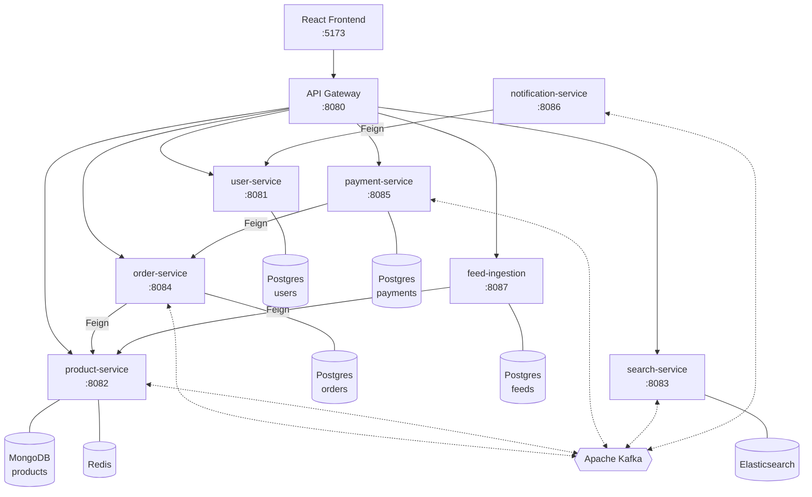
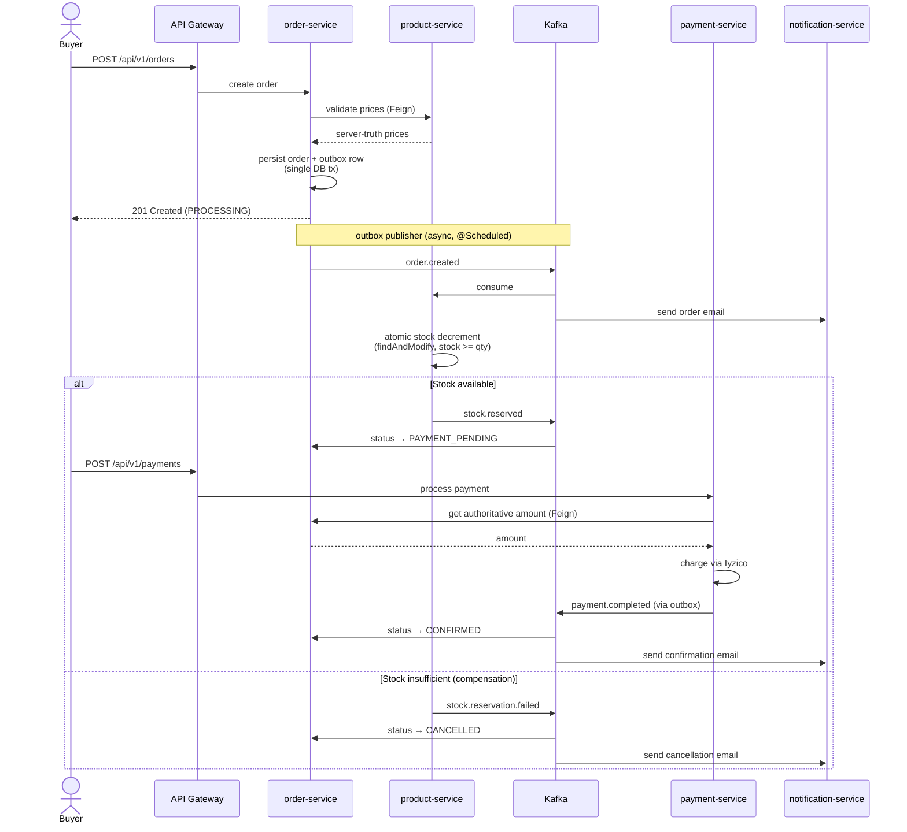

# Marketplace

A modern e-commerce platform built with microservices architecture.


## Overview

Marketplace is a full-stack e-commerce platform featuring buyer and seller workflows, real-time search, Kafka-based event-driven communication, and Iyzico payment integration.

## Architecture

Solid arrows are synchronous calls (HTTP/Feign). Dashed arrows are asynchronous Kafka events. Each service owns its own datastore — no service reads another service's database directly.



Cross-cutting infrastructure (not shown above to keep the diagram readable):
- **Eureka** (`:8761`) — service discovery; every service registers on startup.
- **Spring Cloud Config** (`:8888`) — centralized configuration.
- **Prometheus + Tempo + Grafana** (`:3001`) — metrics scraping, distributed tracing, and the pre-provisioned overview dashboard.


## Services

| Service | Port | Description | Stack |
|---------|------|-------------|-------|
| api-gateway | 8080 | Routes requests to services | Spring Cloud Gateway |
| user-service | 8081 | Authentication, buyer/seller registration | Spring Boot, PostgreSQL, JWT |
| product-service | 8082 | Product CRUD, inventory | Spring Boot, MongoDB, Redis |
| search-service | 8083 | Full-text product search | Spring Boot, Elasticsearch |
| order-service | 8084 | Order management, Saga pattern | Spring Boot, PostgreSQL, Kafka |
| payment-service | 8085 | Payment processing | Spring Boot, PostgreSQL, Iyzico |
| notification-service | 8086 | Email notifications | Spring Boot, Kafka, JavaMail |
| feed-ingestion-service | 8087 | Google Merchant XML catalog import | Spring Boot, PostgreSQL, OpenFeign |
| config-server | 8888 | Centralized configuration | Spring Cloud Config |
| discovery-server | 8761 | Service discovery | Eureka |

## Tech Stack

### Backend
- **Java 21** + **Spring Boot 3.5**
- **Spring Cloud** (Gateway, Eureka, Config)
- **Apache Kafka** — event-driven communication
- **PostgreSQL** — relational data (users, orders, payments)
- **MongoDB** — product catalog
- **Redis** — caching
- **Elasticsearch** — product search
- **Iyzico** — payment processing
- **Flyway** — database migrations

### Frontend
- **React 18** + **TypeScript**
- **TanStack Router** + **TanStack Query**
- **Zustand** — state management
- **Tailwind CSS** + **shadcn/ui**
- **Vite** — build tool

### Infrastructure
- **Docker Compose** — local development
- **Nginx** — frontend serving
- **Hetzner Cloud** — production hosting
- **GitHub Actions** — CI/CD

## Order Saga

Order placement is a Saga choreography across `order-service`, `product-service`, and `payment-service`. Each step is driven by a Kafka event; failures trigger compensating actions instead of a distributed transaction.



If payment fails after stock has been reserved, `payment.failed` triggers a stock release in `product-service` (idempotent) before the order is marked `CANCELLED`. `product.updated` events are also fanned out to `search-service` so the Elasticsearch index reflects current stock and pricing.

### Reliability patterns in use

| Concern | Mechanism |
|---|---|
| Atomic order + event publishing | Transactional outbox (`order-service`, `payment-service`) with a `@Scheduled` poller |
| Lost messages on consumer failure | `DefaultErrorHandler` + `DeadLetterPublishingRecoverer` — 3 retries, then `<topic>.DLT` |
| Slow / failing dependency | Resilience4j circuit breaker on `order → product`, `payment → order`, `payment → iyzico` |
| Idempotent order creation | Required `idempotencyKey` on `POST /orders` |
| Idempotent stock reservation | `StockReservation` document keyed by `orderId` (RESERVED → RELEASED) |
| Price / amount tampering | Server-authoritative: order pulls `currentPrice` from product, payment pulls `amount` from order |
| Cross-user payment block | `order-service` checks `order.userId == X-User-Id`; payment service uses Feign so the check covers both paths |

## Getting Started

### Prerequisites

- Java 21
- Maven 3.9+
- Docker + Docker Compose
- Node.js 20+ + pnpm

### Local Development

1. **Clone the repository**
```bash
git clone https://github.com/yigitdemirko/marketplace.git
cd marketplace
```

2. **Create environment file**
```bash
cp .env.example .env
# Edit .env with your credentials
```

3. **Build all services**
```bash
make build
```

4. **Start all services**
```bash
make up
```

5. **Start frontend**
```bash
cd frontend
pnpm install
pnpm dev
```

6. **Access the application**
- Frontend: http://localhost:5173
- API Gateway: http://localhost:8080
- Swagger UI: http://localhost:8080/swagger-ui/index.html
- Eureka Dashboard: http://localhost:8761

### Environment Variables

Create a `.env` file in the root directory:

```env
IYZICO_API_KEY=your-sandbox-api-key
IYZICO_SECRET_KEY=your-sandbox-secret-key
MAIL_USERNAME=your-email@gmail.com
MAIL_PASSWORD=your-app-password
```

### Makefile Commands

```bash
make build          # Build all services
make up             # Start all services
make down           # Stop all services
make clean          # Stop services and remove volumes
make test           # Run all tests
make seed           # Seed demo data (2 sellers, 5 buyers, 50 products, ~10 orders)
```

### Seeding demo data

After `make up` finishes and the stack is healthy, run:

```bash
make seed
```

This creates 2 seller accounts (`techhub@demo.marketplace.com`, `homestyle@demo.marketplace.com`), 5 buyer accounts, imports a 50-product Google Merchant XML feed via the `feed-ingestion-service`, and places ~10 orders across the buyers. All accounts use the password `Demo1234`. Re-running is safe at the user level (register-or-login fallback) but creates duplicate products — for a clean reset use `make clean && make up && make seed`. Requires `jq` and `uuidgen` on PATH.

## API Documentation

Swagger UI is available at: `http://localhost:8080/swagger-ui/index.html`

All services are accessible via the API Gateway at `http://localhost:8080`:

| Service | Base Path |
|---------|-----------|
| Auth | `/api/v1/auth` |
| Users | `/api/v1/users` |
| Products | `/api/v1/products` |
| Search | `/api/v1/search` |
| Orders | `/api/v1/orders` |
| Payments | `/api/v1/payments` |
| Feeds | `/api/v1/feeds` |

## Testing

```bash
# Run unit tests
mvn test -pl services/user-service,services/product-service,services/search-service,services/order-service,services/payment-service -Dgroups=unit

# Run integration tests
mvn test -pl services/user-service,services/product-service -Dgroups=integration
```

## CI/CD

- **CI** — Runs on PRs with `backend` or `frontend` label
    - Backend: unit tests + integration tests
    - Frontend: TypeScript check + production build
- **Deploy** — Runs on every push to `main`, deploys only changed services

## Project Structure

```
marketplace/
├── infrastructure/
│   ├── api-gateway/
│   ├── config-server/
│   ├── discovery-server/
│   └── postgres/
├── services/
│   ├── user-service/
│   ├── product-service/
│   ├── search-service/
│   ├── order-service/
│   ├── payment-service/
│   ├── notification-service/
│   └── feed-ingestion-service/
├── frontend/
├── docker-compose.yaml
├── Makefile
└── pom.xml
```

## License

MIT